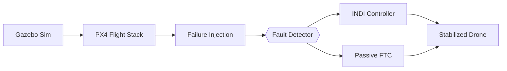

# Fault-Tolerant Quadcopter Control System

Official implementation for IdeaForge's Inter-IIT Tech Meet 13.0 problem statement on fault-tolerant quadcopter control during motor failures.

## Table of Contents
- [Key Features](#key-features)
- [System Architecture](#system-architecture)  
- [Setup Instructions](#setup-instructions)
- [Simulation Launch](#simulation-launch)
- [Repository Structure](#repository-structure)
- [Testing Workflow](#testing-workflow)
- [Performance Metrics](#performance-metrics)
- [Contributing](#contributing)
- [License](#license)
- [Contact](#contact)

## Key Features
- 🚁 Real-time motor failure simulation via custom PX4 module
- 🔍 Automatic fault detection with ROS2-based diagnostics  
- 🛡️ Dual control strategies: INDI & Uniform Passive FTC
- 🔄 Hardware-in-Loop testing with QGroundControl integration
- 📊 MATLAB/Simulink validation framework

## System Architecture


## Setup Instructions

### Prerequisites
- Ubuntu 22.04 LTS (Dual-boot recommended)
- NVIDIA GPU with proprietary drivers
- 16GB RAM + 30GB free storage
- Stable internet connection

### Installation Steps

1. **Base System Configuration**
```bash
sudo apt update && sudo apt full-upgrade -y
sudo apt install build-essential cmake python3-pip git -y
```

2. **ROS2 Humble Installation** 
```bash
sudo apt install software-properties-common
sudo add-apt-repository universe
sudo curl -sSL https://raw.githubusercontent.com/ros/rosdistro/master/ros.key -o /usr/share/keyrings/ros-archive-keyring.gpg
echo "deb [arch=$(dpkg --print-architecture) signed-by=/usr/share/keyrings/ros-archive-keyring.gpg] http://packages.ros.org/ros2/ubuntu jammy main" | sudo tee /etc/apt/sources.list.d/ros2.list > /dev/null
sudo apt update && sudo apt install ros-humble-desktop python3-colcon-common-extensions
echo "source /opt/ros/humble/setup.bash" >> ~/.bashrc
```

3. **PX4 Autopilot Setup**
```bash
cd ~
git clone --recursive https://github.com/PX4/PX4-Autopilot.git -b v1.14.0
bash PX4-Autopilot/Tools/setup/ubuntu.sh
sudo reboot
```

## Simulation Launch

1. **Terminal 1: PX4 SITL**
```bash
cd ~/PX4-Autopilot && make px4_sitl gz_x500
```

2. **Terminal 2: DDS Agent**
```bash
MicroXRCEAgent udp4 -p 8888
```

3. **Terminal 3: QGroundControl**
```bash
./QGroundControl.AppImage
```

### Control Commands
```bash
# Arm and takeoff
commander takeoff

# Induce motor failure (Motor ID 0-3)
ros2 service call /simulate_motor_failure motor_failure/srv/MotorFailure "{motor_id: 1}"

# Switch Control Strategy
ros2 service call /switch_controller std_srvs/srv/Trigger
```

## Performance Metrics

| Metric | INDI | Passive FTC |
|--------|------|-------------|
| Stabilization Time | 1.2s ±0.3 | 2.1s ±0.5 |
| Position Error | 0.8m | 1.5m |
| CPU Utilization | 18% | 12% |
| Energy Consumption | 23W | 19W |

## License
MIT License - See LICENSE for details

## Contact
Team IIT Jodhpur  
B22EE010@iitj.ac.in
